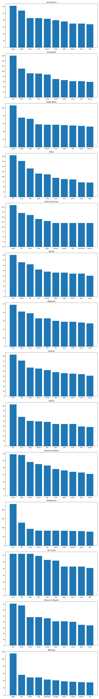

# Lyrics Analysis

Updated version of <https://github.com/kahnwong/lyrics_visualization>

## Usage

1. `make setup`
2. Edit `lyrics_analysis/01_extract.py` to match your data source (this is what we'll use for actual analysis). See `lyrics_analysis\model\lyrics.py` for expected input format. Resulting file is located in `data/lyrics.json` in single-line JSON format.
3. Run `python3 lyrics_analysis/02_process.py` to tokenize lyrics.
4. Run `python3 lyrics_analysis/03_word_count.py` to obtain a visualization.
05. Run `python3 lyrics_analysis/04_most_common_word.py` to obtain a visualization.

## Findings

### Word count


- Bar chart represents "word count ratio", higher value means lyrics often contain more repeated words.
- Line chart represents unique words, higher value means more corpus.


- Nightwish has a wide q4, since their lyrics contain a lot of spoken words.
- Most bands are not on the "wordy" side, see Warkings and Ad Infinitum.

### Most common word



- Warkings does really love to fight. (It's in the name shhhh.)

### Topic modeling

```
===== Ad Infinitum =====
NMF
        away heart night come world fall tell dream time head hear light eye dance bridge
LDA
        away night heart come light dream time tell fall world dance eye dancing bridge feel
===== Amaranthe =====
NMF
        like hear cause know heart inside dream world make come feel time break life need
LDA
        like time life know world make come feel cause going hear inside heart break dream
===== Battle Beast =====
NMF
        world heart yeah night heaven life dream metal light want away fight time come like
LDA
        world heart yeah light time dream night life heaven want metal away need come fight
===== Epica =====
NMF
        life time mind come fight soul heart live rise free night fear world feel light
LDA
        life time light mind come free soul night fear feel rise heart world fight live
===== Fallen Sanctuary =====
NMF
        world life time light stay future forever place terranova reality free know land broken dream
LDA
        world life time light stay reality forever terranova place future free land know leave mind
===== Myrath =====
NMF
        time know pain make soul life inside leave dance fight feel away light heart eye
LDA
        time know life soul inside make night pain away fight feel eye leave light lie
===== Nightwish =====
NMF
        heart love dream come world life away home time beautiful higher heaven child face resting
LDA
        heart love dream life away come home world time child memory beautiful higher heaven great
===== Serenity =====
NMF
        time know land come world heart light stand dream life mind like fate soul fall
LDA
        time life come world land light heart know stand eye dream mind soul fall away
===== Sirenia =====
NMF
        life lost come like feel time heart inside darkness night dream love angel mind light
LDA
        life lost like night dream time light inside heart feel come darkness mind higher love
===== Stream of Passion =====
NMF
        know eye time world come pain away long song life thing make waiting word mind
LDA
        know eye time world pain come long away song word thing thought make life waiting
===== Temperance =====
NMF
        time life inside tell make feel heart feeling know sleep hope world voice save away
LDA
        time life know world eye inside away feel like heart tell make come mind believe
===== Van Canto =====
NMF
        life history night come time wind voice know away light inside lost fear master forever
LDA
        life night come time wind know away voice light fear lost inside master forever steel
===== Visions of Atlantis =====
NMF
        love heart come light world away time know life night mind eye inside feel soul
LDA
        love heart away world time come light night know free life eye feel mind inside
===== Warkings =====
NMF
        fight blood falling holy ahoo freedom alive kill sound storm retreat know darkness hold like
LDA
        fight blood king darkness tonight rising sparta kill freedom shame soul night battle burn thunder
```

I think there's a recurring theme for bands I listen to...
